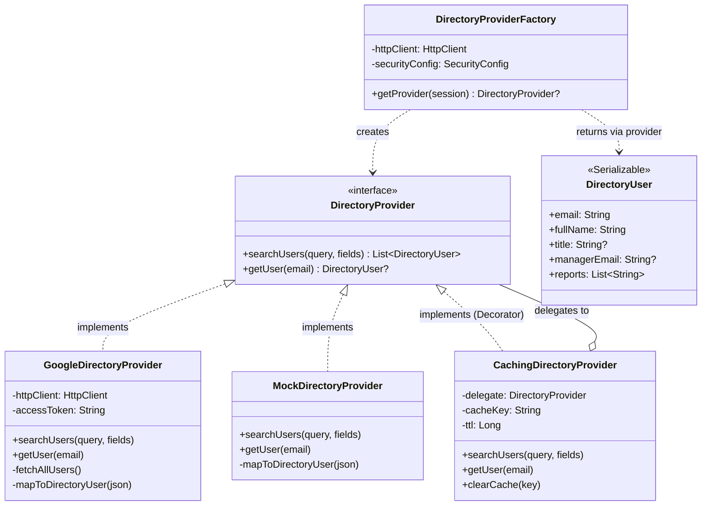
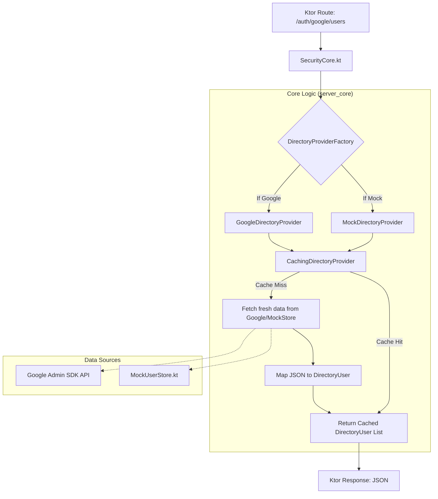

# System Architecture

This document describes the architectural patterns and component relationships used in the core directory and authentication system.

## Design Patterns

1.  **Strategy Pattern (Provider)**: The `DirectoryProvider` interface allows the system to switch between different data sources (Google Workspace vs. Mock data) without changing the business logic.
2.  **Decorator Pattern**: `CachingDirectoryProvider` wraps a base provider to add in-memory caching logic transparently.
3.  **Factory Pattern**: `DirectoryProviderFactory` encapsulates the logic for selecting, initializing, and caching the correct provider implementation based on the user session.
4.  **Value Object Pattern**: `DirectoryUser` provides a stable, type-safe representation of a user, decoupling the application from external API schemas (like Google's JSON).

## Class Diagram

## Data Flow

## Core Components

### SecurityConfig
A type-safe configuration object loaded at startup. It validates all authentication settings and allow-lists, ensuring the application fails fast if configuration is missing.

### MySession
The primary session object stored in a signed cookie. It contains the user identity, roles, and the OAuth access token required for directory operations.

### StatusPages (Error Handling)
Centralized error handling that maps domain exceptions (e.g., `UserNotFoundException`) to appropriate HTTP status codes and JSON error responses.
